|From|Our Reference|Tel|
| :- | :- | :- |
|MS/EDA5-XC|Kha Tran Manh||

![ref1]![ref2]![ref3]![ref4]![ref5]![ref6]![ref7]![ref8]![ref9]![ref10]![ref11]
|Recipient||
| - | - |
|Cc||
|Topic|**CAN BOARD PRACTICE – DIAGNOSTIC COMMUNICATION** |
| - | - |

**Requirements specification**   

1. # **Benefit**
After this practice, students will understand and have experience on Diagnostic UDS-ISO14229. This Diagnostic standard is supported by most of ECUs in Automotive nowadays. 

Students able to implement the most important Diagnostic services ($27 - Security access; $22-ReadDataByIdentifier and $2E- WriteDataByIdentifier)

Students also have knowledge and can implement CAN\_TP layer in Transport protocol layer based on CAN protocol. The main purpose is to send and receive more than 8 bytes of data.

Also, students will get familiar with Diagnostic specification that is closely with actual project.
1. # **System Overview**
The system includes 2 CAN BUS with difference role: 1 diagnostic tester (Tester) and 1 ECU.

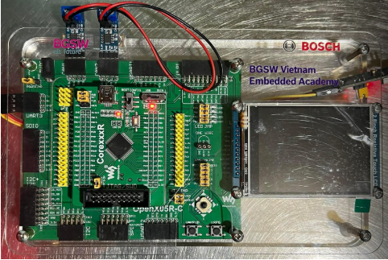

The board can perform diagnostic communication via CAN protocol.

Below picture depicts difference layers. The detail specification of each layer in following session of this document.

1. # **Physical Layer**
The physical layer shall fulfil with the requirements of ISO11898-2/5.

The diagnostic communication speed is the same as application communication speed.
1. # **Data link Layer**
The data link layer shall fulfil with the requirements of ISO11898-1.

The CAN DLC contained in every diagnostic CAN frame transmitted by ECU shall always be set to eight (8) bytes. To avoid bit padding, the unused data bytes of a CAN frame shall be padded with 55h.

ECU can receive diagnostic CAN frame with a DLC less than eight (8) which is send by Tester.
1. # **Network layer**
   1. ## ***Addressing Method***
This specification requires that the ECU only supports normal addressing, and therefore 11 bit CAN identifiers shall be used.

Only physical addressing shall be supported by ECU. Functional addressing not needs to be supported.
1. ## ***Diagnostic CAN ID***
Request Id: 0x712

Response Id: 0x7A2

Tester send request via Request Id to ECU. Then ECU response the request by Response Id.
1. ## ***Diagnostic Message Format***
The CAN message frame format is described in the following table. For detailed definition, please refer CAN\_TP documentation or the training material.

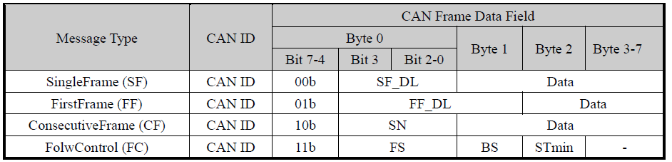
1. ## ***Parameters Definition***
The parameters and workflow of network layer are defined in the following figure and table. For detailed definition, please refer CAN\_TP documentation.

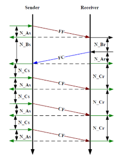

When multi-message required, Sender and Receiver will communicate based on above flow chart.

The Maximum number of ‘FC.Wait frame transmissions’ (N\_WFTmax) shall be set to zero (0). Therefore it is not allowed to use FC.Wait.

The Block Size and Separation time (ms) are defined as below:

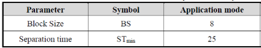

In the scope of this practice, it is not required to implement below Network layer timing parameters. This is for your reference purpose only. In real project, these timing parameters need to be implemented properly. 

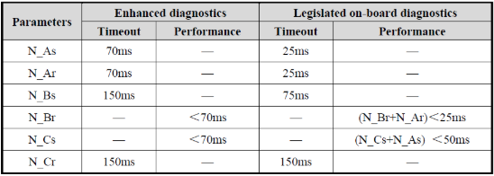
1. # **Diagnostic layer**
   1. ## ***Common specification***
      1. ### **Timing requirement**
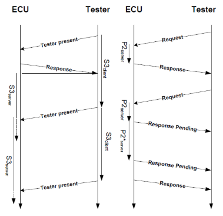

Above picture shows diagnostic layer timing between Tester and ECU. Tester will request and ECU will response based on the request contain.

The parameters of diagnostic layer are defined in the following figure and table. 

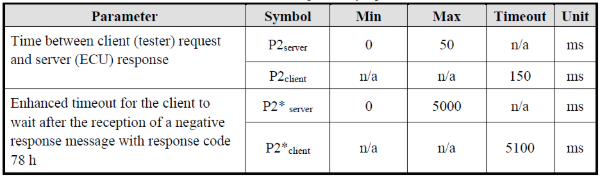

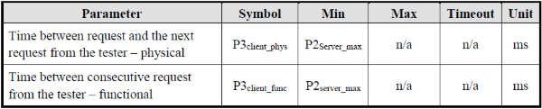

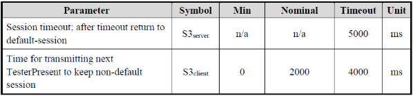

To reduce the complexity of this Diagnostic practice, it is not required to implement above diagnostic parameters.
1. ### **Diagnostic Services**
The chapter defines the diagnostic services and implementation rules.

The following table shows all the UDS diagnostic services. The list has been sorted according to the Service Identifier (SID) assigned to each diagnostic service.

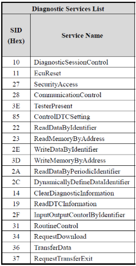

suppressPositveResponseBit (SPRS) is not required for this practice.
1. ### **Negative Response Code (NRC)**
It is not required to implement NRC for this practice. Instead of response NRC, the ECU keep silent and not response anything.

In real project, the ECU need to support many differences NRC based on UDS-14229 standard. NRC helps to diagnose problem quickly.
1. ### **Diagnostic session** 
Typically, all ECUs will support below 3 diagnostic sessions. However, these sessions also not in the scope of this practice.

- Default session.
- ProgrammingSession
- ExtendedDiagnosticSession
  1. ## ***ReadDataByIdentifier (22h)***
The request message requests data record values from the ECU identified by DataIdentifier.

The ECU sends data record values via the positive response message. The format and definition of the RecordValues is defined in separate document. RecordValues shall include analogue input and output signals, digital input and output signals, internal data and system status information if supported by the ECU.
1. ### **Message Format:**
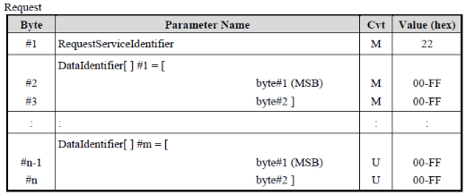

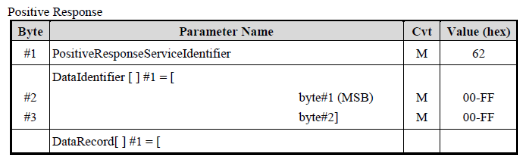

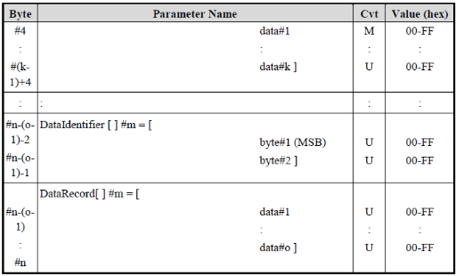

The maximum number of data identifiers to be read within a single request is limited to 1.
1. ## ***SecurityAccess (27h)***
The SecurityAccess service is used to provide a means to access data and/or diagnostic services, which have restricted access for security, emissions, or safety reasons. Diagnostic services for downloading/uploading routines or data into a ECU and reading specific memory locations from a ECU are situations where security access may be required. Improper routines or data downloaded into a ECU could potentially damage the electronics or other vehicle components or risk the vehicle’s compliance to emission, safety, or security standards.

The security access concept uses a seed and key algorithm. For the first step, the tester shall request the ECU to unlock by sending the service SecurityAccess - RequestSeed message.

The ECU shall respond by sending a seed using the service SecurityAccess - RequestSeed positive response message. The seed is the input parameter for tester and ECU to calculate the corresponding key value.

For the second step, the tester shall request by returning a key number back to the ECU using SecurityAccess - SendKey message. The ECU shall compare this key to one internally stored/calculated value. If the two numbers match, then the ECU shall enable (unlock) the tester’s access to specific services/data and indicate that with the service SecurityAccess - SendKey positive response message. If the two numbers do not match, this shall be considered as a false access attempt. If access is rejected for any other reason, it shall not be considered as a false access attempt. An invalid key requires the tester to start over from the beginning with a SecurityAccess - RequestSeed message. The procedure of Send and Key algorithm is showed in following figure.

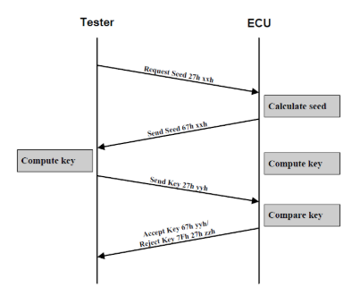
1. ### **Message Format - Request Seed**
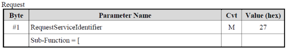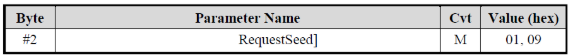

Positive response:

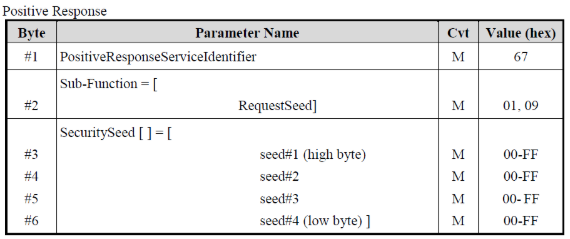
1. ### **Message Format – Send Key**
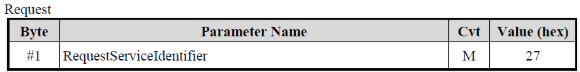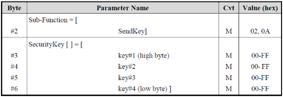

Positive Response:

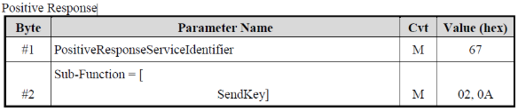

The SecuritySeed and SecurityKey are both 4 bytes (32 bits) number. The security access algorithms of each level would be defined and described in a specific file.

The SecuritySeed is a random number except for two value 00000000h and FFFFFFFFh.

Only one security level shall be active at any instant of time.

If the tester sends an invalid key, the request is rejected by ECU and insert 10s delay before it can receive and process next seed request.
1. ## ***WriteDataByIdentifier (2E)***
The WriteDataByIdentifier service allows the tester to write information into the ECU at an internal location specified by the provided data identifier. Possible use-cases for this service are:

- Programming configuration information (e.g. VIN).
- Resetting learned values.
- Setting option content.
- Enable or disable function.
  1. ### **Message Format**
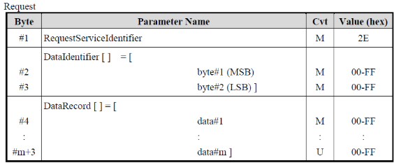

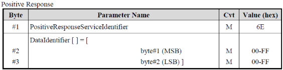
1. ### **Implementation Rules**
Only one (1) dataIdentifier which is supported by the ECU shall be included in the request message.

1. # **Practice list**
   1. ## ***Practice 1 specification (SID: 0x22)***
In this practice, student will implement service $22 - Read Data by Identifier to read data as requirement.

Security access required: NO

Diagnostic session required: NO (All session).

Request format table

|**Byte**|**Parameter name**|**Hex value**|
| :-: | :-: | :-: |
|1|ReadDataByLocalIdentifier Request SID|0x22|
|2|RecordDataIdentifier High Byte|0x00 - 0xFF|
|3|RecordDataIdentifier Low Byte|0x00 - 0xFF|

RecordDataIdentifier table

|**Parameter name**|**Hex value**|
| :-: | :-: |
|Read CANID Value From Tester|0x0123|

Positive Response format

|**Byte**|**Parameter name**|**Hex value**|
| :-: | :-: | :-: |
|1|ReadDataByLocalIdentifier Response SID|0x62|
|2|RecordDataIdentifier High Byte|0x00 - 0xFF|
|3|RecordDataIdentifier Low Byte|0x00 - 0xFF|
|
4

…

4+m
|
RecordData Byte 0

…

RecordData Byte m
|
Data 0

…

Data m
|

Negative Response format

|**Byte**|**Parameter name**|**Hex value**|
| :-: | :-: | :-: |
|1|RecordDataIdentifier Negative Response|0x7F|
|2|RecordDataIdentifier Response SID|0x22|
|3|Negative Response Code|0x00-0xFF|

Negative response table

|**Parameter name**|**Hex value**|
| :-: | :-: |
|Invalid length/response format|0x13|
|DID not support.|0x31|
|General Reject|0x10|

1. ## ***Practice 2 specification (SID: 0x27)***

In this practice, student will implement $27 - Security access service to unlock the ECU. The security will be unlocked within 5 seconds and be indicated by LED-0 from pin-PB0.

This requirement uses Flow Control concept to send KEYS.

Diagnositc session required: NO (All session)

Request SEEDs format table

|**Byte**|**Parameter name**|**Hex value**|
| :-: | :-: | :-: |
|1|SecurityAccess Request SID|0x27|
|2|Security SEED level|0x00 - 0xFF|

Response SEED format

|**Byte**|**Parameter name**|**Hex value**|
| :-: | :-: | :-: |
|1|SecurityAccess Response SID|0x67|
|2|Security SEED level|0x00 - 0xFF|
|3|SEED 0 (random)|0x00 - 0xFF|
|4|SEED 1 (random)|0x00 - 0xFF|
|5|SEED 2 (random)|0x00 - 0xFF|
|6|SEED 3 (random)|0x00 - 0xFF|
|7|SEED 4 (random)|0x00 - 0xFF|
|8|SEED 5 (random)|0x00 - 0xFF|

Request Unlock – send KEYs format table

|**Byte**|**Parameter name**|**Hex value**|
| :-: | :-: | :-: |
|1|SecurityAccess Request SID|0x27|
|2|Security KEY level|0x00 - 0xFF|
|3|KEY 0|0x00 - 0xFF|
|4|KEY 1|0x00 - 0xFF|
|5|KEY 2|0x00 - 0xFF|
|6|KEY 3|0x00 - 0xFF|
|5|KEY 4|0x00 - 0xFF|
|6|KEY 5|0x00 - 0xFF|

Response KEY format

|**Byte**|**Parameter name**|**Hex value**|
| :-: | :-: | :-: |
|1|SecurityAccess Response SID|0x67|
|2|Security KEY level|0x00 - 0xFF|

Security level table

|**Parameter name**|**Hex value**|
| :-: | :-: |
|Level 1: 0x01 for SEED and 0x02 for KEY|0x01/0x02|
|~~Level 2:~~|~~0x03/0x04~~|

Negative Response format

|**Byte**|**Parameter name**|**Hex value**|
| :-: | :-: | :-: |
|1|SecurityAccess Negative Response|0x7F|
|2|SecurityAccess Response SID|0x27|
|3|Negative Response Code|0x00-0xFF|

Negative response table

|**Parameter name**|**Hex value**|
| :-: | :-: |
|Invalid length/response format|0x13|
|Invalid Keys|0x35|
|General Reject|0x10|

The SEED and KEY Algorithm:

KEY-0 = SEED-0 XOR SEED-1

KEY-1 = SEED-1    +    SEED-2

KEY-2 = SEED-2 XOR SEED-3

KEY-3 = SEED-3    +    SEED-0

KEY-4 = SEED-4    AND    0xF0

KEY-5 = SEED-5    AND    0x0F

1. ## ***Practice 3 specification (SID: 0x2E)***
In this practice, student will implement $2E- WriteDataByIdentifier service to write a mount of data into ECU and get the outcome as requirement

Security access required: YES (Security level 1 -> Service$27 Sub Function 01/02).

The service is allowed only in case Security level 1 is unlocked (LED0 is ON – pinPB0).

Diagnostic session required: NO

Request format table

|**Byte**|**Parameter name**|**Hex value**|
| :-: | :-: | :-: |
|1|WriteDataByLocalIdentifier Request SID|0x2E|
|2|RecordDataIdentifier High Byte|0x00 - 0xFF|
|3|RecordDataIdentifier Low Byte|0x00 - 0xFF|
|4|New CAN ID for tester (byte 1)|0x00 - 0xFF|
|5|New CAN ID for tester (byte 2)|0x00 - 0xFF|

RecordDataIdentifier table

|**Parameter name**|**Hex value**|
| :-: | :-: |
|Write CANID Value From Tester. New value will be applied after Ignition cycle (IG OFF -> ON). This Ignition is User Button|0x0123|

Positive Response format

|**Byte**|**Parameter name**|**Hex value**|
| :-: | :-: | :-: |
|1|WriteDataByLocalIdentifier Response SID|0x6E|

Negative Response format

|**Byte**|**Parameter name**|**Hex value**|
| :-: | :-: | :-: |
|1|WriteDataByLocalIdentifier Negative Response|0x7F|
|2|WriteDataByLocalIdentifier Response SID|0x2E|
|3|Negative Response Code|0x00-0xFF|

Negative response table

|**Parameter name**|**Hex value**|
| :-: | :-: |
|Invalid minimum request length (min is 5 bytes).|0x13|
|DID not support.|0x31|
|Security Access denied.|0x33|
|General Reject|0x10|

1. # **Output and evaluation**
   1. ## ***Expected output***
- Requirement analysis: despite how student understand requirement. What tasks need to be done. (ignore)
- OPL (Open point list) file: all of student’s doubts as well as answers will be documented in this file.
- Design document: describe how your program is structure.
- Code: to evaluate clean code
- Test spec, test result, test log: follow the template here

  ` `

- Presentation document on process and result.
  1. ## ***Evaluation***
- Functionality: follow defined test cases.
- Requirement analysis: how well requirement was analysed.
- Design: how well design is.
- Clean code
- Test: how well of test case.
- Oscilloscope  (from Osc picture -> decode to contains of CAN frame)

![ref12]![ref13]

[ref1]: Aspose.Words.87284876-d9b8-4249-9c4b-57b674cb19da.001.png
[ref2]: Aspose.Words.87284876-d9b8-4249-9c4b-57b674cb19da.002.png
[ref3]: Aspose.Words.87284876-d9b8-4249-9c4b-57b674cb19da.003.png
[ref4]: Aspose.Words.87284876-d9b8-4249-9c4b-57b674cb19da.004.png
[ref5]: Aspose.Words.87284876-d9b8-4249-9c4b-57b674cb19da.005.png
[ref6]: Aspose.Words.87284876-d9b8-4249-9c4b-57b674cb19da.006.png
[ref7]: Aspose.Words.87284876-d9b8-4249-9c4b-57b674cb19da.007.png
[ref8]: Aspose.Words.87284876-d9b8-4249-9c4b-57b674cb19da.008.png
[ref9]: Aspose.Words.87284876-d9b8-4249-9c4b-57b674cb19da.009.png
[ref10]: Aspose.Words.87284876-d9b8-4249-9c4b-57b674cb19da.010.png
[ref11]: Aspose.Words.87284876-d9b8-4249-9c4b-57b674cb19da.013.png
[ref12]: Aspose.Words.87284876-d9b8-4249-9c4b-57b674cb19da.038.png
[ref13]: Aspose.Words.87284876-d9b8-4249-9c4b-57b674cb19da.040.png
